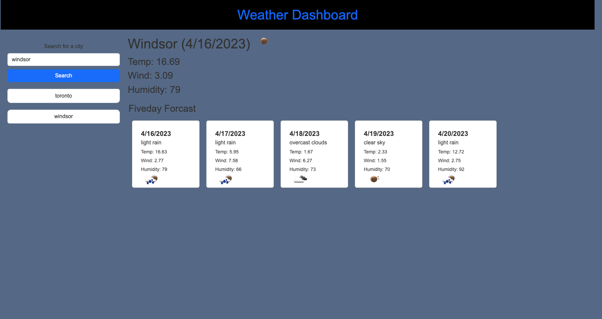

# Weather Dashboard

## Description

This project is a weather dashboard that allows users to search for a city and view the current and future weather conditions for that city. The dashboard also keeps a record of the cities that have been searched and allows users to click on a city in the search history to view its current and future weather conditions.

When a user searches for a city, the dashboard presents the current and future weather conditions for that city. The current weather conditions include the city name, the date, an icon representation of weather conditions, the temperature, the humidity, and the wind speed. The future weather conditions include a 5-day forecast that displays the date, an icon representation of weather conditions, the temperature, the wind speed, and the humidity.

The search history is also updated every time a user searches for a new city, with the new city added to the top of the list. When a user clicks on a city in the search history, the dashboard again presents the current and future weather conditions for that city.

## Author

Keegan Omel

## Contributor

Geronimo Perez,

Austin Grech

## Live Link 

## Github Link

